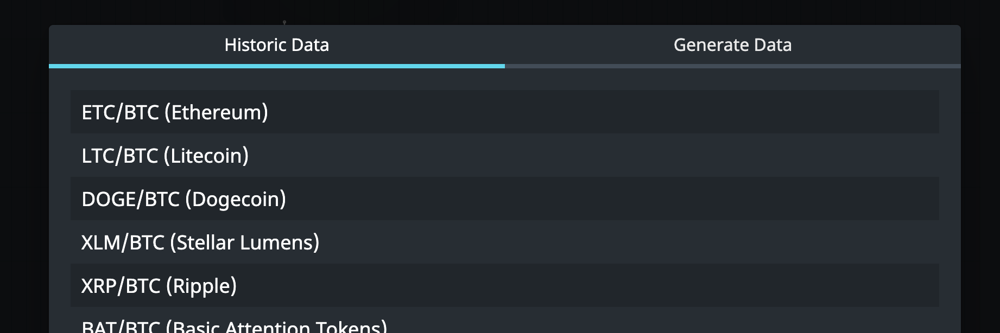
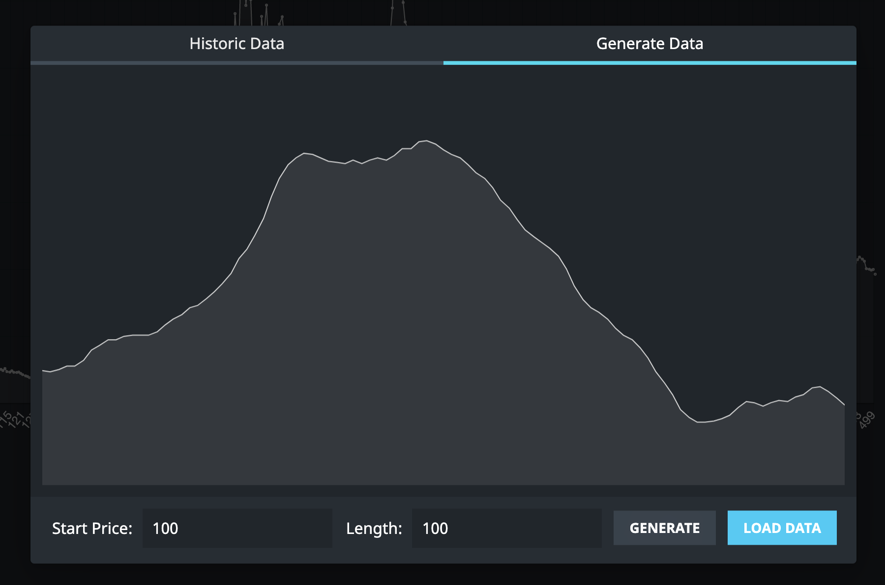

## Motivations

I wanted a platform that would allow for passive strategies that could create and track multiple smaller trades within the same market but only found platforms that would give advice to either sell or buy.
By 'passive' I mean strategies that can be run once or twice a day rather than constantly and without having to compete for speed with high speed trading algorithms.

An example of one such 'passive' strategy would be to open 5 trades on the sell side at increments of 10%. We might only run our strategy once a day, so these open orders can sit there and fill in between and the strategy can just respond the next time it runs, whenever that is, rather than selling once and missing out on any price action in between now and the next run.

## Tick Cycle

I wanted the platform to do as much of the heavy lifting as possible, allowing users to write the smallest amount of code possible to have their strategy run.
For this, I broke the tick cycle in to 3 stages - preprocessing the last tick (if there was one), running the users strategy code and then processing the resulting data and advice.

In the case of paper trading or back-testing, this advice is acted on right away, updating balances and opening & closing orders locally. In the case of real, live trading the advice is handled via the Coinbase API asynchronously, blocking any further tick cycles until API work is resolved.

## Back-testing

To test a strategy, users can select a data set and run their strategy over the price sequence.
As the back-tester runs through the data set it executes the strategy logic and handles any advice given by the logic.
I've included markers to show where on the chart orders were opened & closed and where orders were executed on either side - in some cases (as in the screen shot shown at the top of this article) this results in a busy graph, but gives a clear indication of how the strategy behaved.
The results that this back-tester gives are unrealistically optimistic in that they don't factor in fees or account for the effect real trading would have on the market (however small) - so ignores the inevitable slippages that would normally effect the end result.

## Live 'Paper' Trading

As with the back-tester, users can configure their strategy and run it against live price data.
The data comes from the coinbase-pro API and each incoming tick runs through the same mechanism as the back-tester (for the sake of consistency between the two).
In practice I found this less useful than back-testing simply because the back-testing covers so much time data almost instantly, but it could help to further verify the strategy's behavior.

### Data Sets

To pull in a wide array of historic data sets I created a script to scrape data from CoinGecko.com

I also built a generator to get random new chart shapes to try out.

