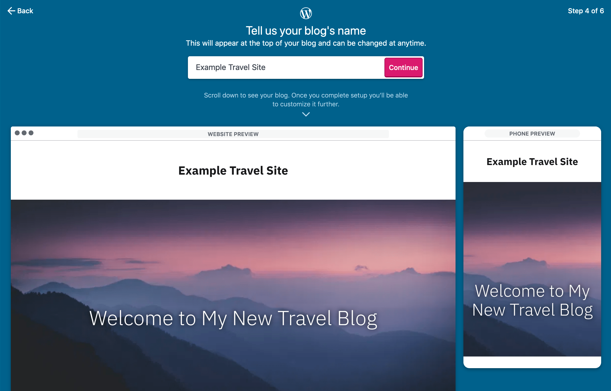
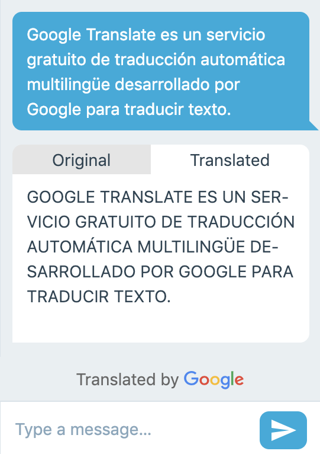

## Calypso

Calypso is the front-end for WordPress.com, built with React, Redux & other related tools. I started contributing to the project voluntarily while I was learning the ropes of react as it seemed like a great example of a large open-source project and ended up sticking around to work on it full-time.

As almost all of our work at Automattic was done within the open source realm you can find a full list of my contributions to wp-calypso [here](https://github.com/Automattic/wp-calypso/pulls?q=is%3Apr+author%3Aspen+is%3Aclosed).

Here are some of my focuses while working on Calypso:

### Onboarding Rebuild

I was part of the team responsible for rebuilding WordPress.com's sign-up flow.
We created a new sign-up experience that aimed to give new users a head-start in their sites creation by importing existing content from other sources, suggesting styles and starter content based on the users details and giving a handful of default themes for them to try on during the sign-up process.

Along the onboarding journey the user sees a preview of both the desktop and mobile versions of their site, making for a more engaging, exciting experience.

The biggest issues in this project came from having to re-write the wizard logic to accept dynamic sign-up flows, where the remaining steps might be determined by the progress made and answers given so far in the sign up journey. As I was joining the team responsible for the delivery of the new onboarding flow I noticed that some of the existing code had oversights that would surface as we built our new plans on top of it. I managed to rewrite this area with sound logic just in time to fix a nasty bug seen in production.

### Simplifying App State with Redux

One area that I focused on both before and after joining Automattic full-time was 'reduxifying' parts of calypso's state, with the goal of removing Flux and Immutable.JS from the codebase altogether.
Given the size and complexity of the app we had many state containers with Flux, each with its own personality and behavior. We wanted to get to a point where all app state would be held in redux - making it easier to access state from anywhere in the app.
It was a lengthy process but allowed us to simplify much of the state logic across the app making the experience of updating those areas of code much easier to navigate and maintain.

### Auto-translate in HappyChat

To provide quicker support to customers whose languages weren't officially supported by policy wwe streamlined the translating process by detecting and translating as messages came in to our internal chat app 'HappyChat'.
Until this point our support engineers would have to keep translations in a separate browser tab, making the process cumbersome and slow.
We didn't launch two-way translation right away as there were concerns about bad or offensive translations.

## Remote By Default

> [Communication is Oxygen](https://automattic.com/creed/communication-is-oxygen/)

One of the more interested aspects to my work at Automattic was in working remotely within a globally spread out company. At one point in time my team included people in the USA, Europe, New Zealand and Australia.
As a result of our overlapping timelines we often worked asynchronously and made sure to over communicate our work between each other.
